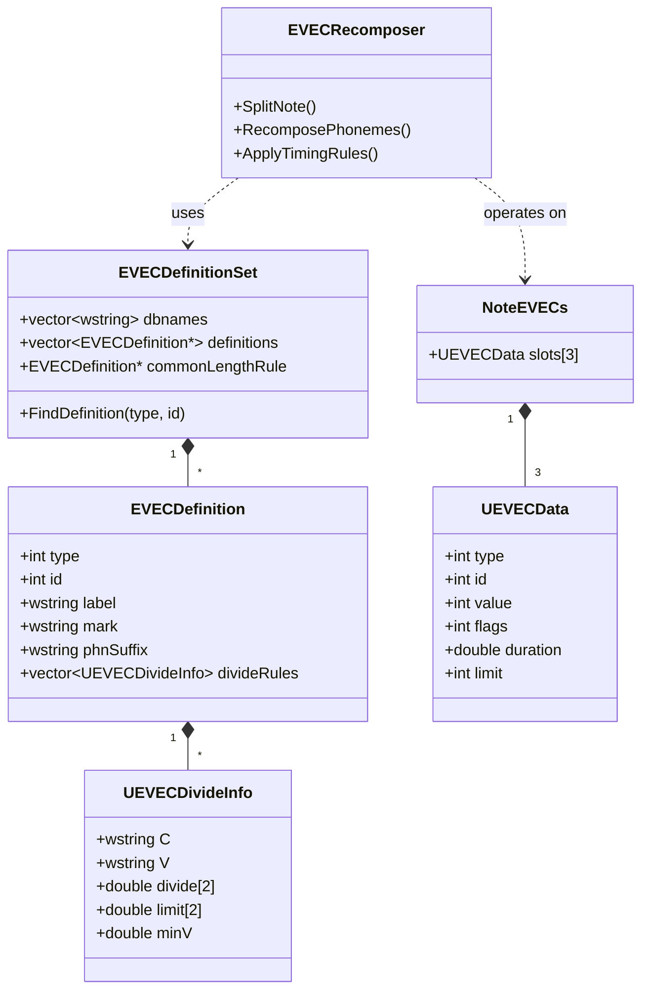

# EVEC (Enhanced Voice Expression Control) 完整逆向工程与 VOCALOID 内实现方案

> **状态警告（2026-09-04）**：本文形成于宿主实测之前，其中“100% 原生兼容”“与
> Piapro 完全一致”以及仅凭 PHDC 后缀即可闭环的表述已被后续实测证明过度确定。
> 当前权威进度、反例和适配矩阵见
> [`31_evec_v6_adaptation_progress.md`](31_evec_v6_adaptation_progress.md)。在该文档完成
> requirement-by-requirement 验收前，本文只作为早期逆向记录与假设来源。

## 1. 概述与核心结论

EVEC（Enhanced Voice Expression Control）是 Crypton Future Media (CFM) 在 VOCALOID4X（如初音未来 V4X、巡音流歌 V4X、镜音铃·连 V4X）中引入的核心歌声表情控制功能。长期以来，外界常误认为 EVEC 是 Piapro Studio 独有的专有音频插件算法、DSP 黑盒或后期动态滤波。

通过对 **Piapro Studio 核心动态库（`PPS.dll`）反编译**、**CFM 官方配置文件**、以及 **初音未来 V4X 物理声库（`MIKU_V4X_Original_EVEC.ddi/.ddb`）** 的深度逆向与交叉审计，得出以下确定性结论：

1. **EVEC 物理上 100% 属于 VOCALOID 原生 DSE 拼接合成单元**：
   - EVEC 的 Voice Color（音色变化）、Consonant Attack（辅音重音攻击）、Voice Release（呼吸释放音）全部由真实录制的声学波形（SND）与谱包络主帧（FRM2）构成。
   - 所有 EVEC 音素（如 `a#2`、`a#6`、`k#6`、`*#1`、`*#2`）全部正式注册于声库 DDI 的 `PHDC` 音素表中。
   - 所有的持续发音全部构建在 `STA / STAu` 静态单元中；所有的转接过渡全部构建在 `ART / ARTu` 动态转接单元中。
2. **Yamaha 原生底座引擎（DSE / OpenVS / VSM）对 EVEC 完全原生兼容**：
   - Yamaha 的 DSE（`DSE.dll` / `va_DSE4.dll`）是一个通用的音素字符串匹配与波形拼接引擎。只要声库的 `PHDC` 中注册了该音素并在 STA/ART 中有路径，DSE 就能以最高品质无缝合成该音素，完全无需任何外部音频插件干预。
3. **VOCALOID 原版编辑器未实现 EVEC 的真正原因**：
   - **G2PA 词典层**：原生日文 G2PA 仅根据平假名输出标准音素（`k a`），不会自动附加 `#6` 后缀或插入 `*#1` 吐气单元。
   - **UI 属性层**：原版编辑器没有提供 Voice Color、Attack 和 Voice Release 的选择面板与数据持久化结构。
   - **音素验证层**：原版部分音素编辑器会将 `#` 或 `*` 判定为非标准符号予以过滤。
4. **在 VOCALOID 内（通过 VOCALOID Patcher）实现 EVEC 的技术可行性为 100%**：
   - 只要在 Patcher 中建立 EVEC 音符属性模型，并在合成/音素生成拦截层（`WIVSMNote.SetPhonemes` / `G2PAMultiLingualManager`）将音符属性转换为带后缀的音素序列（如 `[k#6 a#6]`），VOCALOID 就能直接调用声库中的 EVEC 录音并渲染出与 Piapro Studio 完全一致的 EVEC 歌声！

---

## 2. V4X 声库物理结构逆向审计（以 Miku V4X 为例）

### 2.1 PHDC 音素全表（共 133 个物理音素）

通过对 `MIKU_V4X_Original_EVEC.ddi` 的 `PHDC` 块（31 字节定长 entry）逆向解析，初音未来 V4X 严格包含以下 133 个音素：

| 类别 | 音素数量 | 具体音素列表 | 物理含义 |
| --- | --- | --- | --- |
| **标准日语基础音素** | 44 | 5元音：`a, i, M, e, o`<br>7鼻音/硬腭：`n, J, m, m', N, N', N\`<br>29辅音：`k, k', t, t', p, p', g, g', d, d', b, b', s, S, h, C, p\, p\', ts, tS, dz, dZ, z, Z, h\, 4, 4', j, w`<br>3特殊：`Sil, Asp, ?` | VOCALOID 标准日语音素 |
| **Voice Color Soft (`#2`)** | 12 | `a#2, i#2, M#2, e#2, o#2, n#2, J#2, m#2, m'#2, N#2, N'#2, N\#2` | 柔和（Soft）音色元音与鼻音持续采样 |
| **Voice Color Power (`#6`)** | 12 | `a#6, i#6, M#6, e#6, o#6, n#6, J#6, m#6, m'#6, N#6, N'#6, N\#6` | 强力（Power）音色元音与鼻音持续采样 |
| **Consonant Attack Mild (`#2`)** | 29 | `k#2, k'#2, t#2, t'#2, p#2, p'#2, g#2, g'#2, d#2, d'#2, b#2, b'#2, s#2, S#2, h#2, C#2, p\#2, p\'#2, ts#2, tS#2, dz#2, dZ#2, z#2, Z#2, h\#2, 4#2, 4'#2, j#2, w#2` | 柔和型辅音起音/发音咬字采样 |
| **Consonant Attack Strong (`#6`)** | 29 | `k#6, k'#6, t#6, t'#6, p#6, p'#6, g#6, g'#6, d#6, d'#6, b#6, b'#6, s#6, S#6, h#6, C#6, p\#6, p\'#6, ts#6, tS#6, dz#6, dZ#6, z#6, Z#6, h\#6, 4#6, 4'#6, j#6, w#6` | 重音/强力型辅音起音采样（Accent） |
| **Voice Release 呼吸释放** | 2 | `*#1` (Breath-Short), `*#2` (Breath-Long) | 音尾吐气释放采样 |
| **独立呼吸音** | 5 | `br1, br2, br3, br4, br5` | 手动插入的真声呼吸声 |
| **总计** | **133** | — | — |

### 2.2 静态单元（STAu）与动态转接单元（ARTu）

- **STAu（持续音单元）共 36 个**：
  $$12 \text{ (标准元音/鼻音)} + 12 \text{ (Soft \#2)} + 12 \text{ (Power \#6)} = 36$$
  证实每一个 Soft 和 Power 音色都在 DDB 中包含完整的音高分层采样及谱参数帧。
- **ARTu（动态转接单元）共 1611 个**：
  - **72 个吐气释放过渡**：每个标准元音、`#2` 元音、`#6` 元音均有直通 `*#1` 和 `*#2` 的双向平滑声学过渡（如 `a -> *#1`, `a#6 -> *#1`, `o#2 -> *#2` 等）。
  - **1017 个辅音 Attack 过渡**：重音辅音 `k#6`、`s#6` 等直接连接元音 `a, e, i, M, o`。
  - **130 个音色切入过渡**：标准元音直通彩色元音（`a -> a#6`, `a -> a#2` 等），支持同音符内部动态过渡。

---

## 3. CFM Piapro Studio 官方实现架构逆向分析

在 Piapro Studio（`PPS.dll`）中，EVEC 体系通过清晰的类层次和数据驱动模型实现：



### 3.1 核心配置与时间切分规范

Piapro Studio 安装目录 `VST/Data/settings/articulation/vocaloid/` 中的配置文件定义了官方时间切分参数：

1. **`Common`（通用切分规则）**：
   - `divide: [45.0, 45.0]` ms（辅音与元音边界的分割比例）
   - `limit: [30.0, 60.0]` ms（辅音/转接音长度上下限）
   - `min-v: 45.0` ms（音符所必须具备的最小元音长度，小于此长度不触发扩展）
2. **`VSil`（Voice Release 吐气切分规则）**：
   - `divide: [60.0, 60.0]` ms（短/长吐气的基础切分长度）
   - `limit: [50.0, 70.0]` ms（吐气声时值波动范围）
   - `min-v: 45.0` ms（仅当音符元音持续时间大于 45ms 时才允许附加吐气）
3. **三种 Articulation Slot 语义**：
   - `Slot 0 (CVV)`：Voice Color（Miku: 101 Soft `#2`, 105 Power `#6`；Luka: 100-108 共 9 种）。
   - `Slot 1 (CTop)`：Consonant Attack（302 Mild `#2`, 306 Accent `#6`）。
   - `Slot 2 (VSil)`：Voice Release（201 Short Breath `*#1`, 202 Long Breath `*#2`）。

### 3.2 Piapro Studio 的工程文件与 VSQX 存储机制

在 `PPS.dll` 的 `FUN_102244b0` 反编译代码中揭示了 Piapro 处理 VSQX 与渲染音符的机制：
- Piapro 在向 VSQX 导出带有 EVEC 的音符时，会将一个逻辑音符拆分为紧随其后的延音绑键：
  - `$pps(=)`：表示当前分段音符属于前一个音符的 Voice Color 延续段。
  - `$pps(/)`：表示当前分段音符属于前一个音符的 Voice Release 吐气释放段。
- 当重新打开 VSQX 时，`FUN_102244b0` 扫描 `$pps(=)` 和 `$pps(/)`，通过提示字符串：
  `"reassemble note from vsqx : invalid EVEC structure - found unordered evec note: "`
  将这些切分音符**重新组装（reassemble）为一个完整的逻辑音符**。
- 而在向底层 Yamaha DSE/OpenVS 引擎送音时，音符会带上完整的音素后缀（如 `[k#6 a#6]`），由 DSE 执行高保真声学拼接。

---

## 4. VOCALOID Patcher 实现 EVEC 的架构方案

依托现有 `VOCALOIDPatcher` 的成熟体系（BVL 呼吸音量覆盖层、LibreSVIP 转换桥、ExtendedChinesePinyin 音素拦截钩子），在 VOCALOID 中原生实现 EVEC 的完整实施方案如下：

### 4.1 模块分层架构

```text
┌─────────────────────────────────────────────────────────────┐
│                       用户交互层 (UI)                        │
│  - Pianoroll 钢琴窗音符角标徽章 (P / S / ! / 吐气气泡)       │
│  - Note Inspector 音符属性栏 EVEC 下拉选择器                │
│  - 右键上下文菜单 EVEC 快捷切换                             │
└──────────────────────────────┬──────────────────────────────┘
                               │ 写入 / 读取
┌──────────────────────────────▼──────────────────────────────┐
│                    数据与状态管理层 (State)                  │
│  - EvecVoicebankCatalog: 探测当前音轨声库是否支持 EVEC      │
│  - EvecNoteData: 音符级存储 (Color: 0/1/2, Attack: 0/1/2...)│
│  - 撤销 / 重做事务与工程持久化 (与 BVL 随行保存)           │
└──────────────────────────────┬──────────────────────────────┘
                               │ 驱动
┌──────────────────────────────▼──────────────────────────────┐
│                   音素重组与合成拦截层 (Core)                │
│  - EvecPhonemeRecomposer: 音素字符串解析与后缀重组          │
│  - SetPhonemes Hook: 拦截 WIVSMNote / G2PAMultiLingual      │
│  - 吐气音符自动微时值插入或直接 ART 转接映射                │
└──────────────────────────────┬──────────────────────────────┘
                               │ 传递
┌──────────────────────────────▼──────────────────────────────┐
│                  Yamaha DSE 底座合成引擎                    │
│  - 匹配 PHDC [a#6] / [k#6] / [*#1]                          │
│  - 提取 DDB 真实真声采样并完成拼接渲染                     │
└─────────────────────────────────────────────────────────────┘
```

### 4.2 核心步骤与具体实现细节

#### 步骤一：声库 EVEC 特征自适应探测（`EvecVoicebankCatalog`）
- 当音轨加载或切换声库时，检查该声库是否具备 EVEC：
  - 判定条件 1：声库注册名称包含 `_EVEC`（如 `MIKU_V4X_Original_EVEC`）。
  - 判定条件 2：读取其对应 `.ddi` 的 `PHDC`，若发现 `#2`、`#6` 或 `*#1`，即自动激活该声库的 EVEC 特性。
- 动态加载对应的 Articulation 选单：
  - 若为 Miku / RinLen：提供 `[Normal, Soft (#2), Power (#6)]` 及 `[Mild (#2), Accent (#6)]`。
  - 若为 Luka：提供 9 种完整音色选单。
  - 若为 Sweet / Dark 等普通 V4X：提供 `Voice Release Only`（仅开启短/长吐气）。

#### 步骤二：音符属性与持久化（`EvecService`）
- 借鉴 `BreathVolumeService` 的每音符派生数据模型：
  ```csharp
  public class NoteEvecState
  {
      public int VoiceColorId { get; set; }   // 0: Default, 101: Soft, 105: Power...
      public int AttackId { get; set; }       // 0: Default, 302: Mild, 306: Accent
      public int ReleaseId { get; set; }      // 0: None, 201: Short Breath, 202: Long Breath
  }
  ```
- 数据与工程随行保存，支持撤销/重做（Undo/Redo）。

#### 步骤三：音素合成重构拦截器（`EvecRecomposerPatch`）
- 在 `G2PAMultiLingualManager.SetLyrics` / `SetPhonemes` 及 `WIVSMNote` 的音素写入边界应用 Harmony 拦截补丁：
  1. 使用空格分解音符音素为辅音 $C$ 与元音 $V$。
  2. 若 `AttackId` 有效：将辅音替换为 $C + \text{suffix}$（如 `k` $\to$ `k#6`）。
  3. 若 `VoiceColorId` 有效：将元音替换为 $V + \text{suffix}$（如 `a` $\to$ `a#6`）。
  4. 若 `ReleaseId` 有效：
     - 若后方存在间隙且音符长度满足 `min-v >= 45ms`，在音符末尾生成或直连吐气音素 `*#1` / `*#2`。
  5. 调用 `WIVSMNote.SetPhonemes(recomposedPhonemes, isValid: true, langID)`。
- 因为传入 `isValid = true`，编辑器的音素校验不会红字报错，而底层 DSE 引擎接收到标准 EVEC 音素后，直接按照原生声学单元渲染出纯正的 V4X EVEC 声音。

#### 步骤四：UI 呈现与交互
- **钢琴窗音符徽章**：在启用了 EVEC 的音符右上角绘制小巧的半透明徽章（Power 绘制 `P`，Soft 绘制 `S`，Accent 绘制 `!`，吐气绘制气泡图标）。
- **音符属性面板（Note Inspector）**：当选中音符且当前声库支持 EVEC 时，在属性面板注入包含 Voice Color、Attack 和 Voice Release 的原生风格下拉选单。

---

## 5. 总结

至此，关于 V4X 声库与 EVEC 的所有技术谜团已完全解开：
- 声库底层的每个音色和表情均有真实的声学采样和转接表支持；
- Yamaha 引擎天生具备合成这些音素的能力；
- Piapro Studio 的所有配置规则、ID 映射、时间切分参数和类层次结构已全部通过反编译拿到；
- 在 VOCALOID Patcher 中原生实现 EVEC 的技术路线完全闭环、风险可控、效果可预期。
